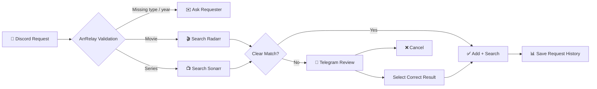

<div align="center">

# 🎬 ArrRelay

### Discord requests → smart validation → Radarr / Sonarr → private Telegram review

**A lightweight, self-hosted media request relay built for Docker.**


[Features](#-features) • [How it works](#-how-it-works) • [Install](#-docker-quick-start) • [Configuration](#-first-run-setup) • [Support](#-support-arrrelay)

<br>

<a href="https://buymeacoffee.com/kasundigital" target="_blank">
  
</a>

</div>

---

## ✨ What is ArrRelay?

**ArrRelay** is a free, open-source automation service that watches selected Discord channels for movie and series requests.

It validates each request, routes **movies to Radarr** and **series to Sonarr**, and sends anything uncertain or broken to a **private Telegram admin review flow**.

> 💬 **Discord** is the request inbox.  
> 🎬 **Radarr / Sonarr** handle media automation.  
> 📲 **Telegram** is the private review console.  
> 🔁 **ArrRelay** connects everything together.

---

## 🚀 Features

| Feature | Description |
|---|---|
| 🐳 **Docker-first** | Simple Docker / Docker Compose deployment |
| 🔐 **Admin-only dashboard** | First-run admin setup and protected login |
| 🌐 **Web UI on port 3032** | Manage integrations and view activity from the browser |
| 💬 **Discord listener** | Watches only the servers/channels you configure |
| 🧠 **Request validation** | Requires **Movie/Series + Title + Year** before automatic processing |
| 🎬 **Radarr integration** | Movie lookup, duplicate detection, add and search |
| 📺 **Sonarr integration** | Series lookup, duplicate detection, add and search |
| 📲 **Telegram review** | Ambiguous matches and errors are sent privately to the admin |
| ✅ **Telegram actions** | Select the correct result or cancel directly from Telegram |
| 🔁 **Duplicate protection** | Prevents adding media that already exists |
| 🗃️ **SQLite history** | Request history survives Docker restarts |
| 📊 **Usage dashboard** | Tracks requests, additions, failures and review activity |
| 📥 **Library statistics** | Shows Radarr movies and Sonarr episode download totals |
| 🧪 **Dry Run mode** | Test safely without actually adding or downloading media |
| 📱 **Responsive UI** | Designed for desktop and mobile |
| ☕ **Built-in support link** | Optional Buy Me a Coffee button for the project |

---

## 🧭 How it works



### Request flow

```text
Discord
   │
   ▼
ArrRelay
   │
   ├── Missing information ───────► Ask requester
   │
   ├── Movie + clear match ───────► Radarr ► Add + Search
   │
   ├── Series + clear match ──────► Sonarr ► Add + Search
   │
   └── Ambiguous / error ─────────► Telegram Admin
                                      │
                                      ├── Select result
                                      └── Cancel
```

---

## 💬 Request format

ArrRelay is deliberately conservative. A request should contain:

- **Type** — Movie or Series
- **Title**
- **Year**

### ✅ Good requests

```text
Movie: No Time to Die (2021)
Series: FBI (2018)
Chicago PD (2014) - Series
```

### ⚠️ Missing information

```text
The Drop
```

ArrRelay will **not guess and download something automatically**.

Instead, it asks the requester for the missing information:

```text
Please include the type, title and year.

Movie: Title (Year)
Series: Title (Year)
```

---

## 📲 Telegram review

When ArrRelay cannot confidently identify the correct item, the request is sent to your private Telegram bot.

Example:

```text
⚠️ ArrRelay review required

Movie: The Drop (2026)
Best confidence: 78%

Select the correct result or cancel.
```

Telegram buttons allow the administrator to:

- ✅ Select the correct movie or series
- ❌ Cancel the request
- 🚨 Receive lookup/add errors

Only the configured **Telegram Admin Chat ID** is authorized to approve requests.

---

## 📊 Admin dashboard

The dashboard is available at:

```text
http://YOUR-SERVER-IP:3032
```

It currently shows:

| Metric | Purpose |
|---|---|
| 📥 Total Requests | All requests ArrRelay has received |
| 🎬 Movie Requests | Requests routed toward Radarr |
| 📺 Series Requests | Requests routed toward Sonarr |
| ⚠️ Needs Review | Requests waiting for manual attention |
| ✅ Added | Successfully added items |
| ❌ Failed | Requests that failed |
| 🎞️ Radarr Movies | Total movies currently in Radarr |
| 💾 Downloaded Movies | Radarr movies that already have files |
| 📡 Sonarr Series | Total series currently in Sonarr |
| 📺 Episodes | Downloaded vs total episodes |
| 🟢 Discord Listener | Current bot/listener status |
| 🕘 Recent Requests | Latest request activity |

---

## 🐳 Docker quick start

ArrRelay is designed so **Discord, Telegram, Radarr and Sonarr credentials are entered in the browser wizard — not in the Docker command**.

### Option A — Docker Run

```bash
mkdir -p /opt/arrrelay/data

docker run -d \
  --name arrrelay \
  --restart unless-stopped \
  -p 3032:3032 \
  -v /opt/arrrelay/data:/data \
  ghcr.io/kasundigital/arrrelay:latest
```

Then open:

```text
http://YOUR-SERVER-IP:3032
```

That's it. ArrRelay automatically creates and stores its own persistent application secret under `/data`.

### Option B — Docker Compose

```bash
mkdir -p /opt/arrrelay && cd /opt/arrrelay
curl -fsSLO https://raw.githubusercontent.com/kasundigital/ArrRelay/main/docker-compose.yml
docker compose up -d
```

Open:

```text
http://YOUR-SERVER-IP:3032
```

### Update later

**Docker Compose:**

```bash
cd /opt/arrrelay
docker compose pull
docker compose up -d
```

**Docker Run:**

```bash
docker pull ghcr.io/kasundigital/arrrelay:latest
docker stop arrrelay
docker rm arrrelay
```

Then run the same `docker run` command again. Your settings remain in `/opt/arrrelay/data`.

### Build from source

Developers who want to build the current source locally can use:

```bash
git clone https://github.com/kasundigital/ArrRelay.git
cd ArrRelay
docker compose -f docker-compose.build.yml up -d --build
```

---

## ⚙️ First-run setup

The first time you open ArrRelay, a **6-step setup wizard** collects everything the application needs:

1. 🔐 **Admin account**
   - Admin username
   - Admin password

2. 💬 **Discord**
   - Bot token
   - Server / Guild ID
   - Request channel ID(s)
   - Private-DM or temporary channel-reply mode

3. 📲 **Telegram**
   - Bot token
   - Admin Chat ID

4. 🎬 **Radarr**
   - URL
   - API key
   - Root folder
   - Quality profile ID

5. 📺 **Sonarr**
   - URL
   - API key
   - Root folder
   - Quality profile ID

6. 🧪 **Automation**
   - Match confidence
   - Dry Run

All integration values are stored in the persistent ArrRelay SQLite database under `/data`.

> **Recommended:** leave **Dry Run enabled** until Discord → ArrRelay → Radarr/Sonarr → Telegram has been tested successfully.

### 📘 Don't know where to get the tokens or IDs?

Use the detailed setup guide:

**[FIRST-RUN-SETUP.md → Discord token, Server ID, Channel ID, Telegram Chat ID, Radarr/Sonarr API keys and more](docs/FIRST-RUN-SETUP.md)**

The same help link is available directly from the ArrRelay wizard and Settings page.

---

## 💬 Discord requirements

Your Discord bot should have only the permissions it needs for the configured request channels:

- 👁️ View Channel
- 📚 Read Message History
- ✉️ Send Messages — only if using channel replies
- 📝 Message Content Intent enabled in the Discord Developer Portal

For a quieter setup, choose:

```text
DM requester privately
```

in ArrRelay settings.

> Discord does not support a normal channel message that is visible only to one regular user. Use DM mode when strict privacy is required.

---

## 🔐 Security

ArrRelay is designed to keep administration private.

### Recommended

- 🔑 Never commit your `.env` file
- 🔒 Never expose Discord / Telegram / Radarr / Sonarr API keys
- 🧂 Change `APP_SECRET` before deployment
- 🌐 Use HTTPS behind a reverse proxy for internet access
- 🏠 Keep the dashboard LAN/VPN-only where possible
- 📲 Use only your private Telegram Chat ID for approval
- 🧪 Start with `DRY_RUN=true`

---

## 🗃️ Persistent data

ArrRelay stores application data in SQLite:

```text
/data/arrrelay.db
```

Docker Compose maps:

```text
./data:/data
```

This preserves:

- Admin account
- Integration settings
- Request history
- Request statuses
- Dashboard statistics

across container recreation.

---

## 📁 Project structure

```text
ArrRelay/
├── app/
│   ├── main.py
│   ├── web.py
│   ├── runtime.py
│   ├── discord_bot.py
│   ├── telegram_bot.py
│   ├── service.py
│   ├── parser.py
│   ├── arr_client.py
│   ├── database.py
│   ├── settings_store.py
│   ├── models.py
│   ├── config.py
│   ├── templates/
│   └── static/
├── tests/
├── data/
├── Dockerfile
├── docker-compose.yml
├── requirements.txt
└── README.md
```

---

## 🛣️ Roadmap

- [x] Discord request listener
- [x] Movie / Series / Year validation
- [x] Radarr lookup and add
- [x] Sonarr lookup and add
- [x] Telegram review buttons
- [x] Admin-only dashboard
- [x] Browser-based settings
- [x] Docker deployment
- [x] Request statistics
- [x] Buy Me a Coffee support link
- [ ] Persist Telegram review candidates across container restarts
- [ ] Better natural-language request parsing
- [ ] Requester follow-up context
- [ ] Playback/problem report detection
- [ ] Additional dashboard charts
- [ ] Release tags and upgrade instructions

---

## 🤝 Contributing

Contributions, bug reports and feature requests are welcome.

If you find a problem, open a GitHub issue with:

- ArrRelay version / commit
- Docker logs
- Expected behavior
- Actual behavior
- Radarr / Sonarr version where relevant

Please **never include API keys, bot tokens or passwords** in an issue.

---

## ☕ Support ArrRelay

ArrRelay is **free and open source**.

If ArrRelay saves you time or you would like to support continued development:

<div align="center">

<a href="https://buymeacoffee.com/kasundigital" target="_blank">
  
</a>

**Support free and open-source development of ArrRelay.**

</div>

The same support option is available from the ArrRelay admin interface.

---

## 👨‍💻 Author

**Kasun Indika**  
GitHub: [@kasundigital](https://github.com/kasundigital)

---

<div align="center">

### 🎬 ArrRelay

**Discord → Radarr / Sonarr → Telegram**

Built for self-hosters who want simple, controlled media request automation.

⭐ If ArrRelay is useful to you, consider starring the repository.

</div>
